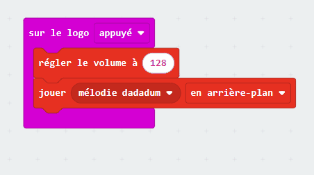

Tu peux régler le volume sur le micro:bit pour rendre les sons plus forts ou plus silencieux.

Tu peux trouver le bloc `régler le volume à`{:class='microbitmusic'} dans le menu `Musique`{:class='microbitmusic'}.


Pour utiliser le bloc `régler le volume à`{:class='microbitmusic'}, fais-le glisser au-dessus d'un bloc `jouer`{:class='microbitmusic'}.
Dans cet exemple, un bloc `jouer mélodie`{:class='microbitmusic'} a été utilisé à l'intérieur d'un bloc `appuyé`{:class='microbitinput'}.

```microbit
input.onLogoEvent(TouchButtonEvent.Pressed, function () {
    music.setVolume(128)
    music._playDefaultBackground(music.builtInPlayableMelody(Melodies.Dadadadum), music.PlaybackMode.InBackground)
})
```

Tu peux augmenter ou diminuer le volume en faisant glisser le curseur de gauche à droite.



### Réglage du volume pour les utilisateurs V1

Si tu utilises un micro:bit V1, il n'y a pas de haut-parleur pour diffuser les sons, tu devras donc brancher des écouteurs aux broches GPIO.

Jette un œil au [guide de micro:bit pour t'aider à brancher tes écouteurs](https://makecode.microbit.org/projects/hack-your-headphones/make){:target="_blank"}.
