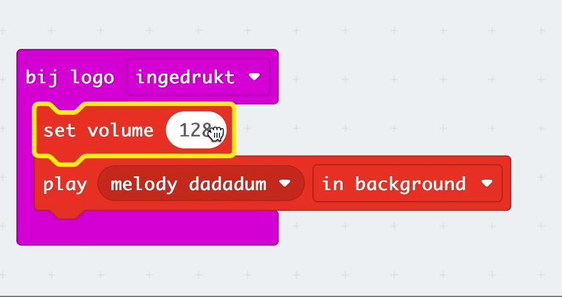

Je kunt het volume instellen op de micro:bit om geluiden harder of zachter te maken.

Je kunt het blok `set volume`{:class='microbitmusic'} vinden in het `Muziek`{:class='microbitmusic'} menu.


Om het `set volume`{:class='microbitmusic'} blok te gebruiken, sleep je het boven een `play`{:class='microbitmusic'} blok.
In dit voorbeeld is een `play melody`{:class='microbitmusic'} blok gebruikt in een `bij logo ingedrukt`{:class='microbitinput'} blok.

```microbit
input.onLogoEvent(TouchButtonEvent.Pressed, function () {
    music.setVolume(128)
    music._playDefaultBackground(music.builtInPlayableMelody(Melodies.Dadadadum), music.PlaybackMode.InBackground)
})
```

Je kunt het volume verhogen of verlagen door de schuifregelaar van links naar rechts te slepen.



### Het volume instellen voor V1-gebruikers

Als je een micro:bit V1 gebruikt, is er geen luidspreker om de geluiden af te spelen, maar moet je een koptelefoon op de GPIO-pinnen aansluiten.

Bekijk de [gids van de micro:bit om je te helpen je koptelefoon aan te sluiten](https://makecode.microbit.org/projects/hack-your-headphones/make){:target="_blank"}.
